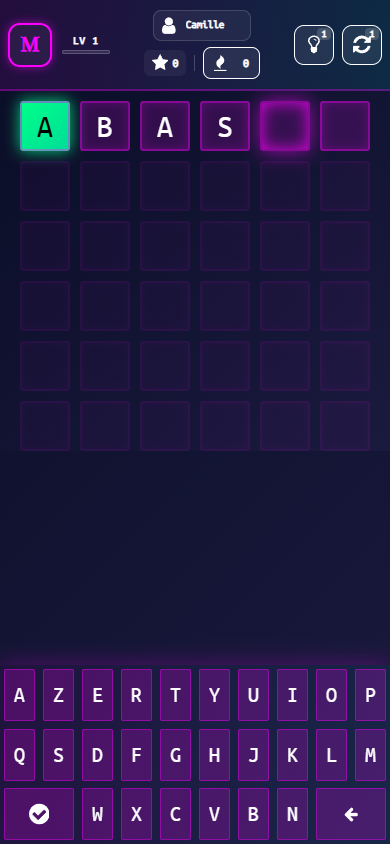
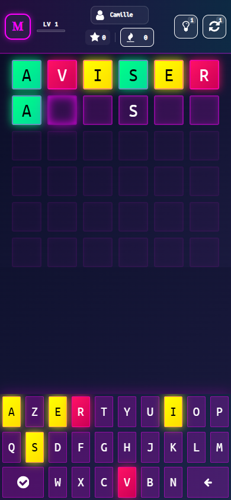
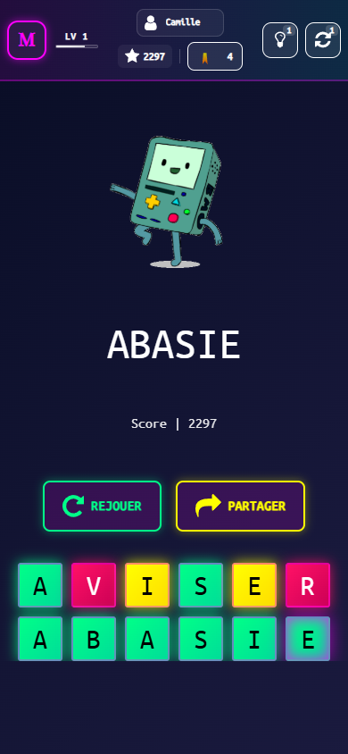
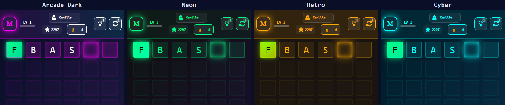

<h1 align="center">Motle</h1>

  <em>A French Wordle. Six tries, one word, no hints you didn't pay for.</em>

  

  <a href="#how-to-play">How to play</a> ·
  <a href="#the-colours">The colours</a> ·
  <a href="#winning--scoring">Scoring</a> ·
  <a href="#themes">Themes</a> ·
  <a href="#install-it">Install it</a>

---

<table>
  <tr>
    <td width="50%" valign="top">
      <h2>How to play</h2>
      
<strong>Motle</strong> is <em>Le Mot</em> reimagined as an arcade cabinet. A hidden French word is waiting; you get <strong>six attempts</strong> to find it, and every guess has to be a real French word — not a string of hopeful letters.

      
Play in your browser or install Motle on your home screen to play offline.

      <ul>
        <li>The word is <strong>5 to 8 letters</strong>, French, and shown in <strong>uppercase</strong>.</li>
        <li><strong>The first letter is already filled in</strong> and cannot be changed.</li>
        <li>Type the remaining letters into the tiles, then confirm.</li>
        <li>Each guess has to be <strong>a real French word</strong>. Anything else flashes red and <strong>does not use up an attempt</strong>.</li>
      </ul>
    </td>
    <td width="50%" align="center" valign="middle">
      
    </td>
  </tr>
</table>

---

<table>
  <tr>
    <td width="50%" align="center" valign="middle">
      
    </td>
    <td width="50%" valign="top">
      <h2>The colours</h2>
      
After each guess, tiles light up to show how close you got:

      <ul>
        <li>🟩 <strong>Green</strong> — Right letter, right place. Locked in.</li>
        <li>🟨 <strong>Yellow</strong> — Right letter, wrong place. It's in the word somewhere else.</li>
        <li>🟥 <strong>Red</strong> — This letter isn't in the word at all.</li>
        <li>🟦 <strong>Blue</strong> — Revealed by a clue. Free information.</li>
      </ul>
      
The keyboard colours itself from every guess you've made, accumulating knowledge as the round goes on.

    </td>
  </tr>
</table>

---

<table>
  <tr>
    <td width="50%" valign="top">
      <h2>Winning & Scoring</h2>
      
Find the word in 6 attempts and you win. Run out and you lose — but the answer is shown either way.

      
Score rewards <strong>finishing early</strong> and <strong>using rare letters</strong>. Correct letters found early are worth more, while rare letters and yellow matches add a bonus.

      <ul>
        <li><kbd>REJOUER</kbd> starts a fresh game.</li>
        <li><kbd>PARTAGER</kbd> copies your result grid to the clipboard.</li>
        <li>Tap the revealed word to look up its definition via online dictionary integration.</li>
      </ul>
    </td>
    <td width="50%" align="center" valign="middle">
      
    </td>
  </tr>
</table>

---

## Themes

  

Tap the logo in the top-left corner to cycle through the four arcade palettes: **Arcade Dark**, **Neon**, **Retro**, and **Cyber**. Your choice is remembered automatically.

---

## Install it

Install Motle on your home screen to launch it like an app.

- **Android / Chrome** — tap the menu → *Install app*
- **iOS / Safari** — tap Share → *Add to Home Screen*
- **Desktop Chrome / Edge** — click the install icon in the address bar

After your first visit, it works offline.